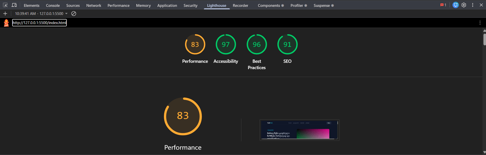
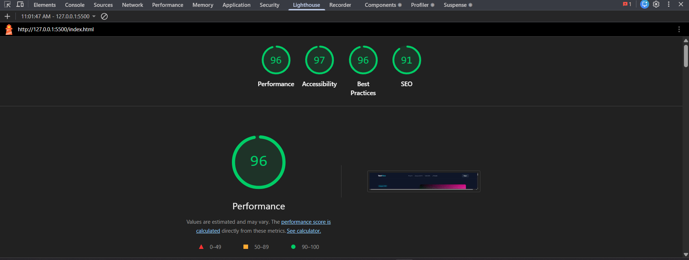
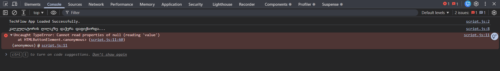
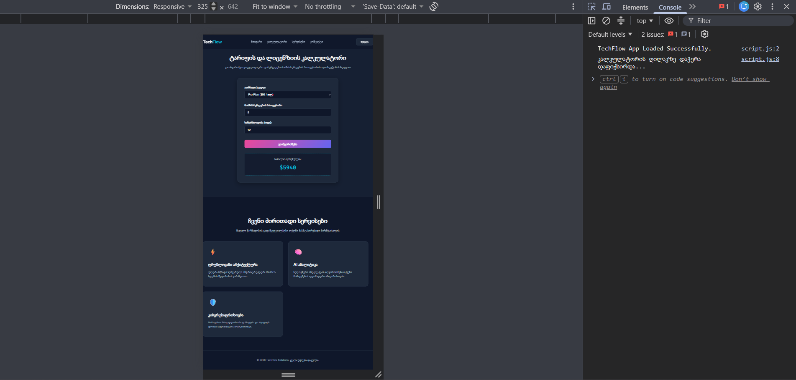
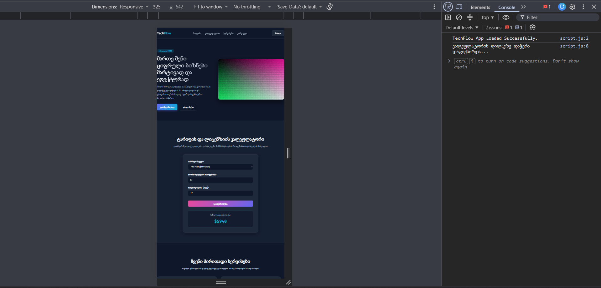

## ახსნა

პრობლემა მოგვარდა სურათის ზომის შემცირებით რის შედეგადაც სურათის ჩატვირთვას ნაკლები რესურსი დასჭირდა და ასევე lazy-loading-ის ატრიბუტის დამატებით lazy loading-ი სურათს მანამ არ ჩატვირთავს სანამ viewport-ი არ გამოჩნდება.

ერორის პრობლემას წარმოადგენდა არასწორად დაკავშირებული ID-ი, ID-ის სახელის შესწორებიტ ერორიც გასწორდა. NaN-ის პრობლე წარმოდგენდა არასრულად დაწერილი value რომელიც მანამდე ასე იყო დაწერილი val რის გამოც ვერ კითხულობდა ჯავასკრიპტი value-ში ჩაწერილ მნიშვნელობას.

 
რესპონსივის პრობლემას წარმოადგენდა სწტიკურად გაწერილი width-ი რის გამოც როცა სატის ზომა მცირდებოდა სექციების ნაწილები მაინც იგივე ზომის რჩებოდა რის გამოც პატარა ეკრანზე ცდებოდა კონტენტს.
