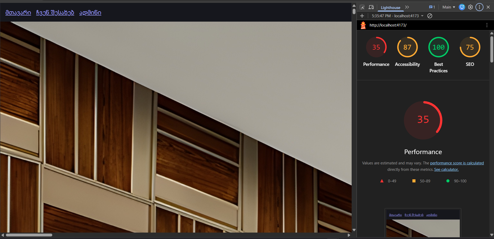
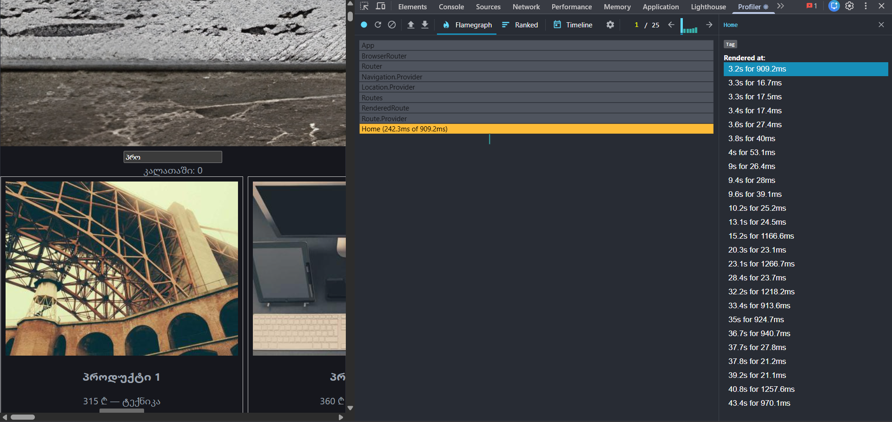
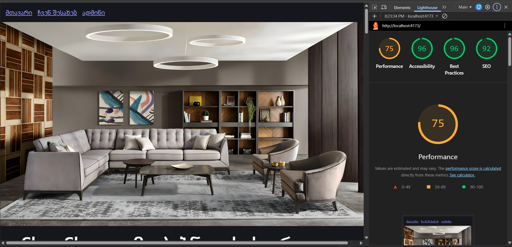
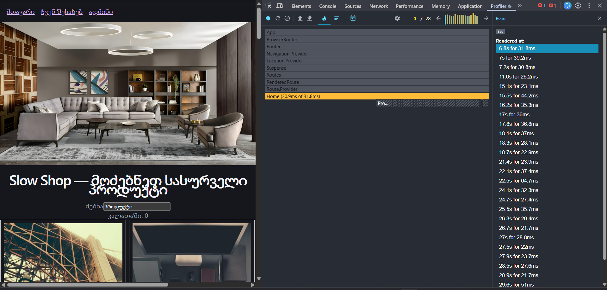
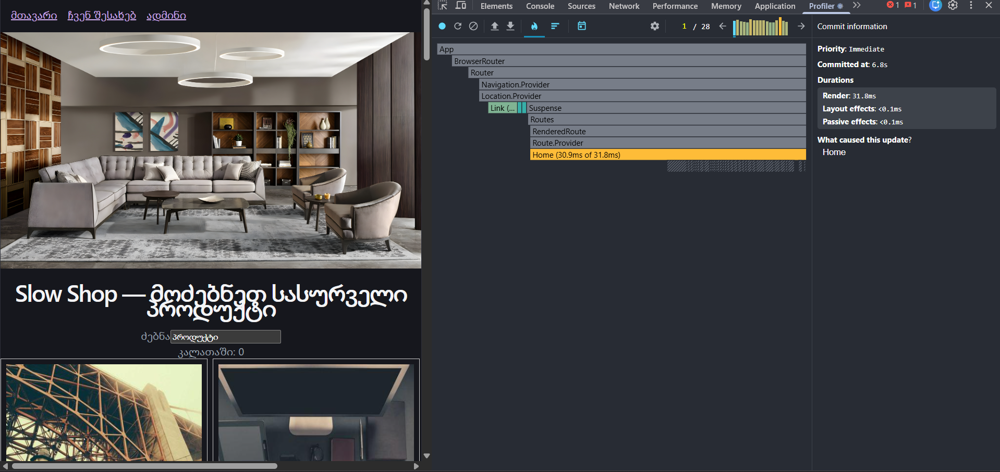

BEFORE   

PROBLEMS
Lighthouse-დან (Performance 35 / Accessibility 87 / Best Practices 100 / SEO 75):

1 Performance 35/100. კრიტიკულად დაბალი ქულა. მთავარი მიზეზია დიდი, ოპტიმიზაციის გარეშე hero სურათია (hero.jpg 9MB) და 5000-ქარდიანი სიის ერთდროული რენდერი.

2 LCP (Largest Contentful Paint) ცუდია hero სურათს არ აქვს width/height, არც fetchpriority="high", რაც აჩერებს მთავარი გვერდის ჩატვირთვას.

3 CLS (Cumulative Layout Shift) სურათებს (hero-საც და ProductCard-ის სურათებსაც) ზომები არ აქვთ მითითებული ბრაუზერი სივრცეს წინასწარ ვერ გამოყოფს, გვერდი ხტება ჩატვირთვისას.

4 SEO 75/100. index.html-ს არ აქვს <meta name="description">, Open Graph ტეგები და canonical link Google-ისთვის გვერდი ცარიელია.

5 Accessibility 87/100. ძებნის <input>-ს არ აქვს label/aria-label; ProductCard-ის სურათებს არ აქვთ alt ატრიბუტი screen reader-ისთვის უხილავია რას აჩვენებს ბარათი.

Profiler flame graph-დან (Home render):

6 ერთი render 242.3ms-ს სჭირდება მხოლოდ Home-ს ეს არის ის ხელოვნური 5000-ციკლიანი "მძიმე ფილტრი", რომელიც ყოველ keystroke-ზე თავიდან სრულდება, რადგან useMemo-ში არ არის გატანილი.

7 25 commit ჩაწერილია მოკლე ინტერვალში, თითოეული 900ms-1200ms+ ხანგრძლივობით (მარჯვენა სიაში ჩანს "15.2s for 1166.6ms", "23.1s for 1266.7ms", "32.2s for 1218.2ms" და ა.შ.) ანუ ერთი სიმბოლოს აკრეფაც კი იწვევს წამზე მეტ ხანგრძლივობის სრულ re-render-ს ეს პირდაპირ ადასტურებს input-ის "დაბლოკვის" შეგრძნებას.

8 ProductCard-ები ხელახლა ირენდერება ყოველ keystroke-ზე, მიუხედავად იმისა, რომ დიდი ნაწილის props არ იცვლება ეს ჩანს React.memo-ს არარსებობის და key={index}-ის გამო, რაც React-ს არასწორად ატყუებს reconciliation-ისას.

9 onAdd callback ყოველ render-ზე ახლდება (inline arrow ფუნქცია) ეს თავად ამტვრევს React.memo-ს ეფექტს, თუნდაც მას მოგვიანებით დაამატებთ.

10 5000 ელემენტის ერთდროული DOM-ში ყოფნა არც პაგინაცია, არც ვირტუალიზაცია, ამიტომ ბრაუზერი ყოველ commit-ზე დიდი DOM subtree-ს ამუშავებს.

AFTER

  